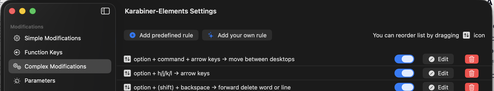

# Karabiner-Elements mappings ⌨️

key remappings for [Karabiner Elements](https://karabiner-elements.pqrs.org/).

> [!TIP]
> *"why is this even needed?"*
> 1. [hjkl mapping](./modifications/vi-option+hjkl→arrow-keys.json) (**most important one**) - you ideally don't want to move out of the *home row* when typing.
> 2. save clicks for navigation (notice how many times you need to click to get to a word want to edit)
> 3. **most noticble** - once you start using it, you can't come back!

# 🚀 "installation" 

1. *general Karabiner elements setup (install, give permissions, etc..)*
2. press *`add your own rule`*

3. copy & paste the desired modification(s)

# 🔗 mappings

## navigation

| shortcut | action | vi-style | macOS-native |
|---|---|:---:|:---:|
| `⌥⌘ ←/→/↑/↓` | Move between desktops | | ✅ |
| `⌥ h/j/k/l` | Arrow keys (left/down/up/right) | ✅ | |
| `⌥ b` | Jump to beginning of word | ✅ | |
| `⌥ e` | Jump to end of word | ✅ | |
| `⌥ u` | Jump to start of line | | |
| `⌥ i` | Jump to end of line | | |

## editing

| shortcut | action | vi-style | macOS-native |
|---|---|:---:|:---:|
| `⌥ ⌫` | Forward delete word | | ✅ |
| `⌥ ⇧ ⌫` | Forward delete to end of line | | ✅ |

---

# modification files

| file | description |
|---|---|
| [`modifications/option-command-arrow→move-desktops.json`](./modifications/option-command-arrow→move-desktops.json) | Move between desktops with `⌥⌘` + arrow keys (or `hjkl`) |
| [`modifications/vi-option+hjkl→arrow-keys.json`](./modifications/vi-option+hjkl→arrow-keys.json) | `⌥hjkl` as arrow keys |
| [`modifications/option-backspace→forward-delete.json`](./modifications/option-backspace→forward-delete.json) | `⌥⌫` forward-deletes a word; `⌥⇧⌫` deletes to end of line |
| [`modifications/vi-option-b-e→word-start-end.json`](./modifications/vi-option-b-e→word-start-end.json) | `⌥b` / `⌥e` jump to start / end of word |
| [`modifications/option-u-i→line-start-end.json`](./modifications/option-u-i→line-start-end.json) | `⌥u` / `⌥i` jump to start / end of line |

---
# other keyboard useful keyboard shortcuts
1. command shift N - new folder in finder
2. command option shift N - new file in finder (will add soon)
3. command shift G - go to location in finder (e.g. for you get a path from ai chat)
